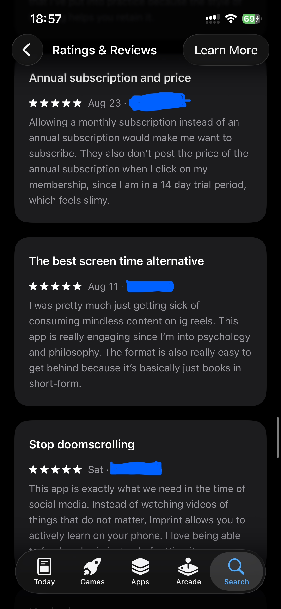
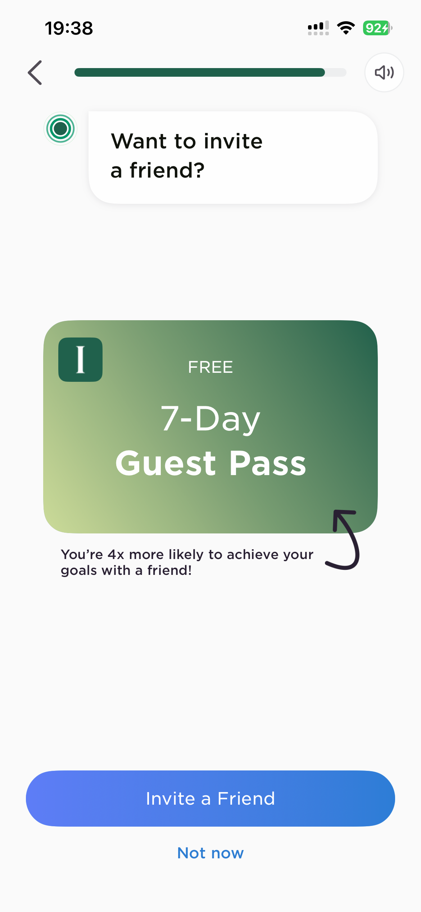

# Imprint: A Growth and Monetization Case Study

**Value before commitment, a daily learning rhythm, and shared learning**

**Role:** Product Growth case study
**Product:** Imprint, a visual learning app
**Project type:** Independent concept proposal

> **Scope note:** Based on Imprint's public onboarding flow, ~20 App Store reviews, a competitive scan of Headway and Blinkist, and product-design heuristics. Conversion figures are illustrative and would need validation through Imprint's internal analytics.

---

## 1. Overview

Imprint helps people learn complex ideas through visual, structured lessons. Its onboarding already invests heavily in personalization, asking users what they want to focus on, what topics they like, how much time they have, and when they want to learn, all before they've completed a single lesson.

The opportunity isn't to optimize a paywall. It's to help a new learner **feel the product's value before being asked to commit**, then give them a reason to return and a paid offer that feels flexible and shareable.

**The proposal:** an integrated growth loop, *experience value → build a learning rhythm → commit flexibly → learn with someone else*, combining a value-first onboarding flow, a daily return loop ("My Learning Rhythm"), a lower-commitment quarterly plan, and a shared-subscription option ("Imprint Duo").

**Expected outcome:** at least a **10% relative lift** in trial-to-paid conversion, without hurting revenue per new user, refund rates, or notification trust.

---

## 2. Market Context

Imprint appeals to people who want intellectual growth but may struggle with attention, consistency, or knowing what to learn next. Its value isn't just access to content, it's **helping users turn curiosity into a repeatable habit**.

### Competitive landscape

| App | Free tier | Trial | Paid pricing | Differentiator |
| --- | --- | --- | --- | --- |
| **Imprint** | Onboarding + limited content | 7-day trial (card required) | Monthly/annual subscription | Visual concept cards across broad topics |
| **Headway** | 1 free book summary/day, no card | Inconsistent by plan | ~$15-20/mo or ~$90/yr | Gamification, streaks, habit mechanics |
| **Blinkist** | 1 rotating "Blink of the day" | 7-day trial (card required) | ~$8.33/mo billed annually | Largest library (9,000+ titles) |

Headway's own positioning credits gamification and streaks as its retention edge, exactly what Imprint's onboarding gestures at (daily goal, preferred time) but doesn't yet deliver before the paywall. Imprint's real differentiator, visual learning with active recall, is currently *promised* in onboarding copy rather than *experienced* before commitment is asked for.

---

## 3. Research, Problem, and Target User

### What works today

Clear learner intent (goals like replacing social media, learning a subject, self-improvement), meaningful personalization inputs, and an existing daily cadence (2/5/10-minute goals, preferred time) that's a natural foundation for a habit loop.

### What App Store reviews say

**"Replace doomscrolling" positioning is landing, strongly.** The most repeated theme in positive reviews: users describe Imprint as their alternative to Reels and TikTok, not as a competitor to other learning apps ("haven't touched social media since download," "the best screen time alternative"). This confirms the onboarding's own framing is resonating in practice.

**Pricing mechanics create distrust, independent of the content itself.** Annual pricing not shown up front during the trial ("which feels slimy"), no monthly option, being asked to subscribe "before you've even used it."

**Content depth, not just format, stops some conversions.** Users who liked a specific topic (art history, named directly) wanted more content within it and said they'd have subscribed if the library went deeper. They weren't put off by the paywall itself, just by shallow depth in their interest.



### Where friction occurs

| Observed moment | Friction | Implication |
| --- | --- | --- |
| Several setup screens before content | Users don't yet know if configuring is worth it | Deliver one meaningful lesson sooner |
| Friend invite before product value | Asked to recommend something unexperienced | Move referral after a positive learning moment |
| Daily goal/time set before a lesson | Commit to a routine before understanding the reward | Let them feel value, then schedule a return |
| Benefit statements without demonstration | Claims about memory/application stay abstract | Show recall and feedback in the product itself |



> **Design principle:** Do not ask for commitment before giving users evidence that the commitment is worthwhile.

### Target user: the curious but inconsistent learner

A busy adult who enjoys ideas but doesn't maintain a formal learning habit, unsure what to learn next, skeptical of paying before trying the core experience.

> **Job to be done:** When I have a few spare minutes, help me learn one worthwhile idea that feels relevant and memorable, so I feel progress without deciding what to study or building a complicated routine.

---

## 4. Strategic Insights

**1. Personalization should lead to value quickly.** Use onboarding inputs to serve a relevant first lesson immediately, not just to build a plan behind the scenes.

**2. Learning is more compelling with felt recall.** A quick retrieval moment makes the benefit concrete: *I didn't just consume something, I can remember it.*

**3. A routine needs a clear next action.** A habit forms more reliably when users know exactly what they'll return to, not just that they've set a daily goal.

**4. Referral should follow conviction, not precede it.** Users are better positioned to invite someone after a satisfying lesson, not before they've tried the product at all.

**5. Conversion quality matters more than conversion rate alone.** A lower-friction plan that increases purchases but raises refunds and cancellations isn't a real win.

---

## 5. Growth Strategy

```
Choose an interest → Personalized mini-lesson → Recall check → Daily learning rhythm
→ See progress → Invite a learning partner through Duo
```

**Value before commitment:** a personalized, five-minute proof point before any subscription pressure.

**My Learning Rhythm:** a repeatable daily loop. A quick recall of yesterday's idea, then today's Daily Pick, with progress shown as ideas explored and concepts recalled, not just streaks (a missed day shouldn't erase a sense of achievement).

**Flexible, social monetization:** a quarterly plan for lower commitment, and Imprint Duo for shared value, introduced only after users understand the product.

| Pillar | User value | Business value |
| --- | --- | --- |
| Value-first onboarding | Immediate proof Imprint is useful | Higher-quality trial intent |
| My Learning Rhythm | Less "what should I learn?" friction | Better early retention |
| Quarterly plan | Lower-commitment alternative to annual | Captures commitment-hesitant users |
| Imprint Duo | Shared motivation, a real invite reason | Referral loop, higher perceived value |

---

## 6. What Changes in Onboarding

| Current step | Change | Why |
| --- | --- | --- |
| Multiple setup questions before content | Keep only what's needed to pick a first lesson | Reduce time-to-value |
| Demographic/voice preferences upfront | Defer to profile or post-activation | No benefit shown for answering |
| Friend invite | Remove from early onboarding | Avoid asking for advocacy before conviction |
| Daily goal/time set before a lesson | Ask after the first lesson and recall moment | Choose a routine with the reward understood |
| Paywall before demonstrated value | Show after the first lesson and recall check | Ask for commitment after evidence |

**The value moment a new learner should reach within minutes:** *"You just learned a useful idea. You recalled the key point, not just watched it. Choose when you want your next idea."*

---

## 7. Monetization: Quarterly + Imprint Duo

**Quarterly plan** sits between monthly and annual, for users who see value but hesitate to commit for a year before trusting their routine ("Give your habit a season to grow").

**Imprint Duo** lets quarterly/annual subscribers invite one additional learner to share plan access, each with an individual profile and progress. It gives users a tangible reason to choose a longer plan and grounds referral in shared use rather than a cold invite, addressing the "friend invite too early" friction directly. Duo should never pressure a solo learner, the core experience must stand on its own.

---

## 8. Validation and Metrics

Validate through a phased, randomized rollout (current experience vs. full strategy) before full launch, tracking at least one complete post-conversion cycle to catch early refunds or cancellations.

**Primary metric:** trial-to-paid conversion rate, target **10%+ relative lift**.

**Leading indicators:** first-lesson completion, first recall completion, day-2 return rate, five-day rhythm rate during trial.

**Guardrails:** revenue per new user, refund rate, early cancellation rate, and notification opt-out should not move materially worse. A conversion lift paired with declining revenue or trust isn't a real win.

---

## 9. Risks and Open Questions

| Risk | Mitigation |
| --- | --- |
| Shorter onboarding may reduce personalization quality | Collect deeper preferences after first value |
| A first lesson may delay paywall exposure | Measure net paid conversion and revenue quality, not just trial starts |
| Quarterly pricing may cannibalize annual plans | Measure plan mix and revenue per new user |
| Duo may create account-sharing complexity | One primary + one invited learner, individual profiles |

**Open questions:**

1. Does content depth per topic predict conversion independent of onboarding friction?
2. Does quarterly pricing need a discount relative to monthly?
3. Does Duo retain both the primary and invited learner, or mainly the primary?

---

*Sources: Imprint's public onboarding flow, ~20 recent Imprint App Store reviews, and public pricing pages for Headway and Blinkist, current as of 2026.*