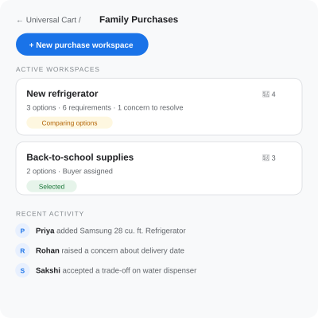
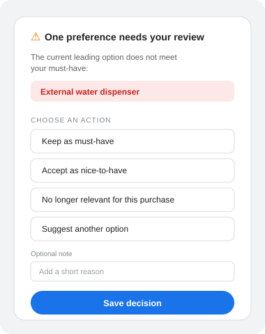
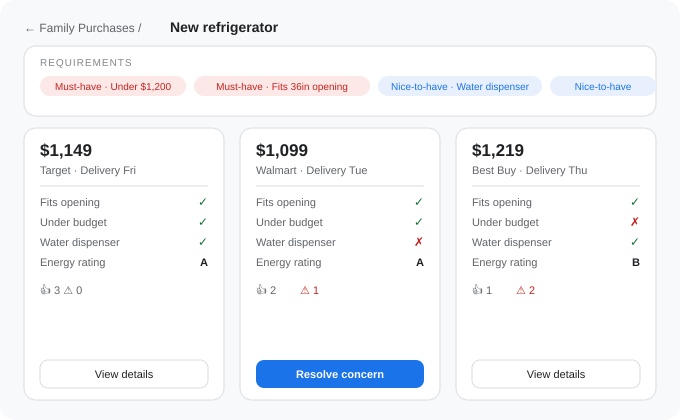

# Universal Cart Circles
### A collaborative decision workspace for family retail purchases

| Field | Details |
|---|---|
| Product area | Google Shopping / Universal Cart |
| Author | Sakshi Yawale |
| Status | Portfolio proposal |
| Research basis | Public product documentation and product hypotheses; no proprietary Google data or primary user interviews |

*[Full PRD, including functional requirements, user stories, acceptance criteria, metrics, and risk analysis →](./universal-cart-circles-prd-full.md)*

---

## Executive summary

Universal Cart Circles is a proposed collaboration layer for Google Universal Cart that helps family members make shared retail decisions. A Circle preserves a small product shortlist, family requirements, structured feedback, trade-off decisions, and purchase ownership, while keeping checkout private and allowing families to continue general conversation in the tools they already use.

Google's Universal Cart is a cross-merchant shopping hub that lets users save products while using Search and Gemini, with YouTube and Gmail planned as additional surfaces. It can track deals, price history, price drops, restocks, and compatibility issues. Circles builds on that foundation by solving a missing group-shopping step: turning scattered family opinions into a documented, purchase-ready decision.

> **Product principle:** Make family shopping decisions easier where commerce happens, while keeping broader conversation where relationships already happen.

---

## Problem statement

Families making shared retail purchases struggle to compare product options, preserve individual requirements, and reach a clear buying decision because links, opinions, specifications, and verbal decisions are scattered across calls, messages, notes, email threads, and retailer websites.

The problem is especially acute for high-consideration purchases such as refrigerators, furniture, electronics, appliances, and school supplies, where a wrong choice can lead to unnecessary returns, delayed replacement, repeat research, overspending, and family frustration. Over time, one family member may become the default organizer while others disengage from the decision process.

**Illustrative scenario:** A family needs to replace a refrigerator. One parent prioritizes capacity and reliability. Another prioritizes price and delivery timing. A teenager wants a water dispenser and a particular finish. Product links are shared in a group chat; more decisions happen over calls. A family member who can't join a call has previously said free delivery and a bottom-freezer layout matter to them, but that requirement gets forgotten. The group can't easily tell which models remain viable, which requirements are mandatory, or who should buy the final selection. The family repeats research, reopens old links, and risks choosing a product that doesn't meet important needs.

---

## Opportunity

Universal Cart Circles converts fragmented discussion into a lightweight, shared decision workspace. It is not a replacement for WhatsApp, iMessage, Discord, or family calls; it captures the decision artifacts from those discussions in the place where commerce happens.

A Circle enables family members to add and compare a small shortlist of products, capture requirements with individual attribution, signal Support, Concern, or No preference on each option, resolve must-have trade-offs explicitly, record a shared selection, assign a buyer only with their acceptance, and hand off to private, individual checkout.

---

## Target users

**Primary persona: Family purchase initiator.** An adult family member who starts or organizes a shared retail decision. They facilitate product research and discussion but do not have unilateral authority to make the final choice. Their core pain: the same person repeatedly researches, chases opinions buried in chats, and loses track of requirements that were only stated once, verbally.

**Secondary persona: Family contributor.** A family member who provides preferences but isn't responsible for research or checkout. Their core need: knowing their requirement was actually considered, without having to search old messages or restate it.

**Job to be done:** When my family is evaluating a retail purchase, I want one shared place to compare a short list of options against our requirements and see the final decision, so that we can choose confidently without losing context across calls, chats, and retailer websites.

---

## Goals

| Goal | Intended outcome |
|---|---|
| Make shared decisions easier | Families move from scattered options to a clear selection |
| Preserve requirements | Each member's needs remain visible and attributable |
| Surface trade-offs | Families consciously address unmet must-haves before selecting |
| Protect privacy | Payment and personal-cart details stay individual |

**Non-goals:** Replacing WhatsApp/iMessage/calls as general communication tools. A full group chat or social-shopping network. Formal voting. Autonomous selection or checkout. Split payments or shared payment credentials.

---

## The key design decision: trade-off resolution

A must-have is not an irreversible veto. Families may decide a trade-off is acceptable, but the trade-off should be deliberate and visible.

When a family is ready to select a product that doesn't meet an active must-have, the member who added that requirement gets a review prompt:

> "This option does not meet your must-have: External water dispenser. Do you still consider this a must-have for this purchase?"

The member can keep it as a must-have (concern stays open), accept the trade-off (reclassify as nice-to-have, optionally say why), mark it no longer relevant, or suggest an alternative. A product becomes eligible for selection only when every active must-have is either met or explicitly resolved by its owner.

This is the core mechanism that separates Circles from a simple shared wishlist: it turns silent disagreement into a visible, resolvable decision.

---

## V1 user journey

1. Create a private Circle and invite family members.
2. Start a purchase workspace (e.g., "New refrigerator").
3. Add products from Search, Gemini, or a personal Universal Cart (explicit share only, up to 5 active options).
4. Add requirements, labeled Must-have / Nice-to-have / No preference, attributed to their creator.
5. Compare products side by side; members mark Support, Concern, or No preference.

6. Resolve trade-offs, the system flags unmet must-haves and prompts the owner to resolve them.
7. Select a product, with a decision summary shown before confirmation.
8. Assign a buyer, who must explicitly accept.
9. Checkout privately (Google Pay or merchant handoff); buyer marks the item Purchased.

---

## A few key requirements

| ID | Requirement | Priority |
|---|---|---|
| FR-6 | Personal-cart products remain private unless explicitly shared to a Circle workspace. | Must |
| FR-9 | Circles shows whether each product Meets, Does not meet, or has Insufficient data for each active requirement. | Must |
| FR-14 | The system flags unmet active must-haves and requires their owner to resolve them before selection. | Must |
| FR-17 | Members can volunteer as buyer or propose another buyer; proposed buyers must accept or decline. | Must |
| FR-22 | The product shows a transparent "Best fit" indicator based on stated requirements. | Should |

*Full requirements list (27 items), user stories with acceptance criteria, and non-functional requirements are in the [full PRD](./universal-cart-circles-prd-full.md).*

---

## Success metrics

**North-star metric: Decision-to-action rate.** Percentage of active Circles that, within 14 days of their first saved option, select a product after every active must-have concern is satisfied or explicitly resolved, and assign an accepted buyer within 48 hours of selection.

**A guardrail worth highlighting:** unresolved-must-have selection attempts, this detects whether the trade-off flow is confusing or getting bypassed, rather than just tracking whether people are using the feature at all.

*Full metric set (supporting metrics and guardrails) is in the [full PRD](./universal-cart-circles-prd-full.md).*

---

## Key risks

| Risk | Mitigation |
|---|---|
| Families remain in chat and don't adopt Circles | Integrate directly with product discovery; keep focused on decision artifacts, not conversation |
| A member uses a must-have to block a decision indefinitely | Let members retain or revisit their requirement without coercive deadlines; make unresolved status visible |
| Best Fit recommendation appears biased or overly authoritative | Keep as Should-have; explain inputs, show alternatives, never auto-select |

---

## Launch and validation plan

**Limited beta:** Recruit 8-12 families for moderated usability testing. Core tasks: create a Circle, add products, add requirements, submit feedback, resolve an unmet must-have, select a product, assign a buyer.

**Beta success criteria:** 80% of participants complete the add-to-selection flow without help. 80% correctly explain how unresolved must-haves affect selection. 90% correctly understand that Circle members can't view another member's payment information. 70% agree Circles makes shared shopping easier to coordinate.

---

*Status: Portfolio proposal based on public Universal Cart documentation and product hypotheses. Not affiliated with or reviewed by Google. [Full PRD →](./universal-cart-circles-prd-full.md)*
